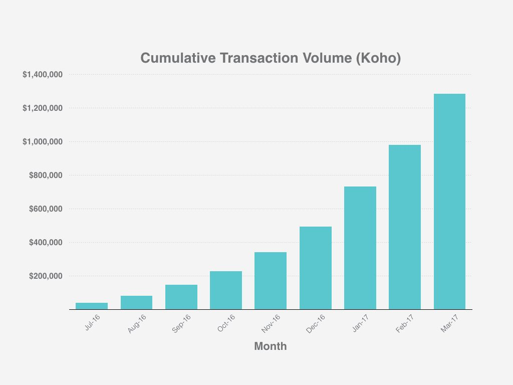

# Case Study 1 KOHO

## Overview and Origin

Koho Financial Inc, better known as "KOHO" is a Canadian fintech company based in Toronto, founded in 2014 by Daniel Eberhard, originally from Vancouver. With a business background, he created the start-up after realizing how unjust the market was in Canada, where people with the least assets pay some of the highest fees to some of the most profitable bank institutions in the world. They considered it to be " an insane misalignment."

After years of carefully studying the market, justifying their vision, and launching a successful beta that surpassed 1 million dollars in transactions, they finally launched the application for public use in 2017.

Thanks to their strong use case and their rapid adoption, the company has raised over 76 million in funding from VC's such as Diagram Ventures, Portag3 Ventures. Greyhound capital, Drive Capital, and angel investors like Les Whiting, Mike Benna, and Scott Lake.

## Business Activities

The company is currently still true to the problem they bow to solve from the beginning, allowing customers to manage their money without all the hidden fees they traditionally find at financial institutions, helping them save money and manage their money better.

Koho currently has over 300,000 Canadians signed up for its services; They have achieved this by targeting Millenials and appealing to their desire for financial freedom. The start-up has capitalized their business partnerships with established businesses like visa and dominion bank as well as exploiting as a competitive advantage the agile practices that allow them to seek and develop partnerships with new financial disruptors like Transferwise, whom they partnered with back in 2019. 
Another significant competitive advantage is the freedom of not depending on brick and mortar branches that the big banks heavily rely on, allowing them to not rely on extra fees charged to the customer in order to turn a profit. 

Thanks to their agility, as mentioned earlier, they are able to explore and utilize to their advantage new technologies that aid them in the improvement and development of their application and practices; some of these technologies are SQL, Kubernetes cluster management, docker,
Google Cloud Platform (BigQuery, Dataflow, PubSub), Python, Java, Golang and RESTful APIs, Docker and AWS, applied cryptography, and security protocols.

## Landscape:

Koho operates in the Banking and financial services space where there have been significant trends and innovations over the last 5-10 years, some  of the greatest been:

- Blockchain: more financial institutions are starting to adopt blockchain technologies in theirprocecess for their  benefits in security and transparency.
- Mobile payment innovations: thanks to the broad adoption of smart devices, many services have shifted to mobile like mobile payment that allows people to transfer money anywhere in the world with a few simple steps.
- Hyper-personalization via big data and AI: since social media, internet searches and all internet activity leaves a digital print, companies have found incentives to capture and filter this data inorder to finda patterns in users that could in turn be utilized for target advertising and search engine optimization.

 

- The levering of social platforms for marketing: as social media shift into smartphones and thenumber of hours that we spend engaged in social media, social platforms transformed into broadcasting tools forcompanies and governments to influence peoples behaivior.

 

 Koho's major competitors are still Canada's major banks, which together make up more than 90% of the Canadian market share. Some of Koho's significant competitors in the fintech space also include Stack and Mogo, who are also disrupting the financial scene in Canada, making it easier for people to not solely rely on major financial institutions. 

 ## Results

Having over 100 employees, over 300,000 Canadians subscribed for their service and making revenue of over 13.5 million per year while helping people achieve their saving objectives. 
Thanks to all this, Koho could be considered to be a success since employee retention, the number of customers signed up, and their yearly revenue are key metrics to determine the success of a business in the fintech space.

## Recommendations

 Koho is already helping people save money and build their credit with their credit service, which is effortless and cheap,these things are traditionally hard for people to achieve because of all the bureaucracy and fees that major banks have to rely on. 

Since Koho is already doing such a great job in helping people navigate the financial industry, mortgages and insurance are topics that incorporate great with their vision since these are two industries known for their high fees, their lack of transparency, and their socio-economical vias. 

Another service that Koho could offer is the implementation of blockchain and digital currencies since they seem to be falling behind by not allowing their customers to spend their digital currencies directly through their Koho card. Furthermore, incorporating blockchain technology into their practices could significantly improve the level of security and transparency that their company projects.

By adopting this technology, the company could capture a significant segment of this new market since there are not many well-trusted and established companies doing the same. 
Capitalizing on their brand recognition in the Canadian market would give them an advantage since this is something that is valued by people that are new to the space or that are skeptical of other new services like MCO's visa card who despite this, is gaining great popularity in Asia.

## links

- https://www.koho.ca/about/
- https://www.mondaq.com/canada/financial-services/403230/qa-with-daniel-eberhard-28-year-old-ceo-and-co-founder-of-koho-a-vancouver-based-financial-technology-startup
- https://angel.co/company/koho/funding
- https://www.globalxetfs.com/a-decade-of-change-how-tech-evolved-in-the-2010s-and-whats-in-store-for-the-2020s/
- https://betakit.com/koho-adds-national-bank-and-drive-as-investors-with-25-million-cad-series-b-extension/
- https://angel.co/company/koho/jobs/1165470-senior-data-engineer
- https://angel.co/company/koho/jobs/244734-senior-product-manager
- https://strategyonline.ca/2019/08/20/inside-the-remaking-of-a-toronto-fintech-company/
- https://www.forbes.com/sites/bernardmarr/2020/12/30/the-top-5-fintech-trends-everyone-should-be-watching-in-2020/?sh=668e8dc64846
- https://www.wns.com/insights/articles/articledetail/547/top-trends-in-banking-and-financial-services
- https://www.cbinsights.com/research/personal-finance-apps-strategies/
- https://bankautomationnews.com/allposts/payments/canadian-neobank-koho-to-launch-credit-and-savings-products-in-2020/
- https://www.mogo.ca
- https://www.getstack.ca
- https://growjo.com/company/KOHO
- https://cointelegraph.com/magazine/crypto-cards-2019/
- https://zerocap.io/millennials-and-bitcoin/